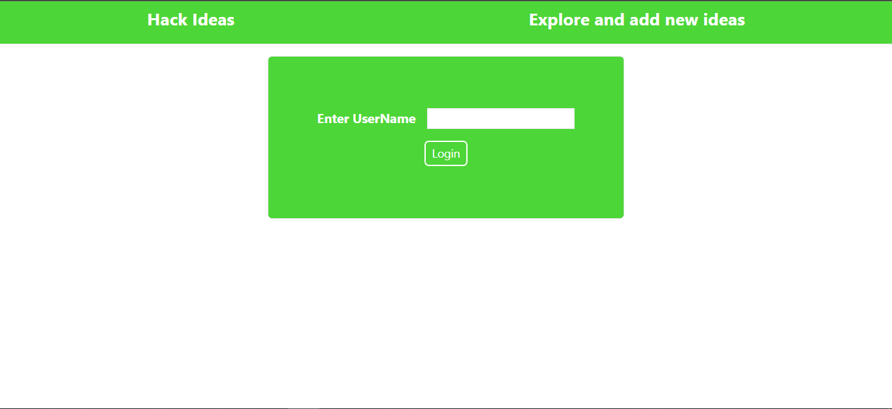
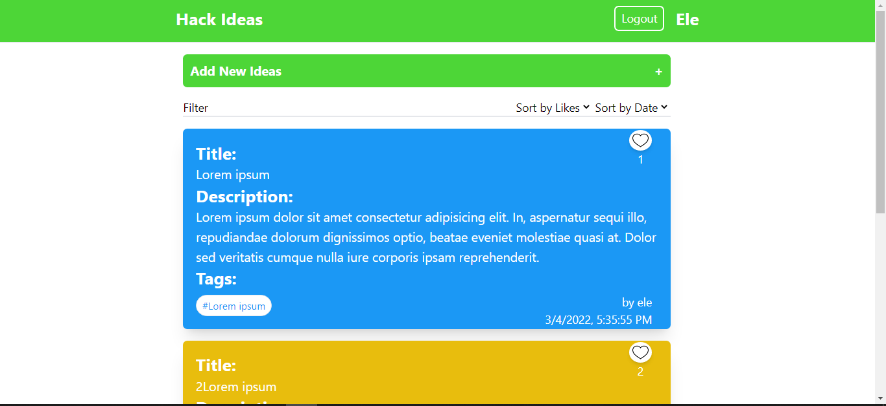
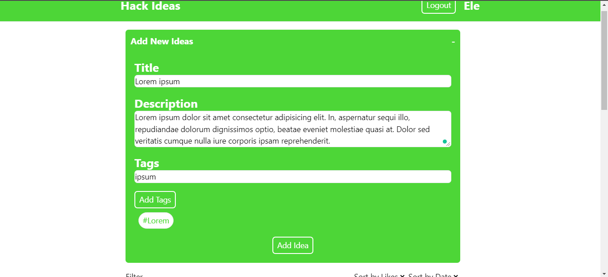
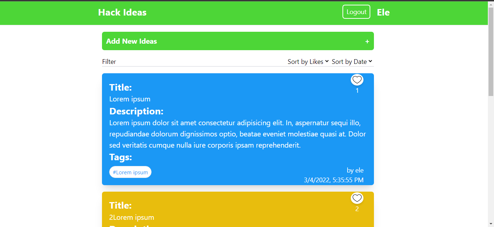
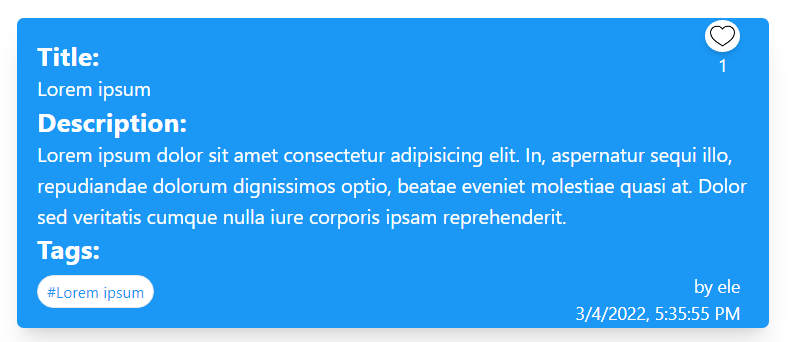
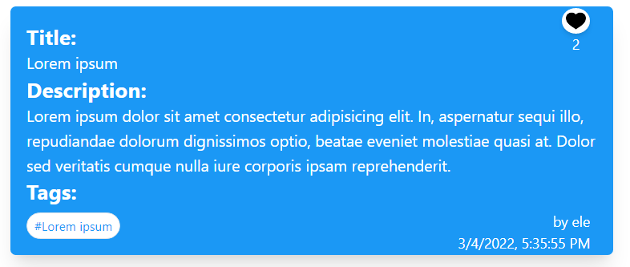

# Hi welcome to the repository

Here is a guide through the site on what is required and how it works

The Live version of this project can be viewed which is hosted on netlify
Netlify:https://sleepy-borg-6238cc.netlify.app

1. First we have a Login page where the user adds their username and logs in the site
   

2. Once logged in the user can view the main page.
   
3. Clicking on the collapsible `Add New Ideas` it opens a form where the user enters Title, Description, and Tags of the Ideas.For Tags a user can add multiple tags by just writing the tag name and cling on `Add Tag`.And post the idea by clicking on `Add Idea`.
   
4. Once the idea is posted you can view it below the filters .
   
5. User can click on heart to like and unlike the post .
   

## Getting Started with Create React App

This project was bootstrapped with [Create React App](https://github.com/facebook/create-react-app).

## Available Scripts

In the project directory, you can run:

### `npm start`

Runs the app in the development mode.\
Open [http://localhost:3000](http://localhost:3000) to view it in your browser.

The page will reload when you make changes.\
You may also see any lint errors in the console.

### `npm test`

Launches the test runner in the interactive watch mode.\
See the section about [running tests](https://facebook.github.io/create-react-app/docs/running-tests) for more information.

### `npm run build`

Builds the app for production to the `build` folder.\
It correctly bundles React in production mode and optimizes the build for the best performance.

The build is minified and the filenames include the hashes.\
Your app is ready to be deployed!

See the section about [deployment](https://facebook.github.io/create-react-app/docs/deployment) for more information.

### `npm run eject`

**Note: this is a one-way operation. Once you `eject`, you can't go back!**

If you aren't satisfied with the build tool and configuration choices, you can `eject` at any time. This command will remove the single build dependency from your project.

Instead, it will copy all the configuration files and the transitive dependencies (webpack, Babel, ESLint, etc) right into your project so you have full control over them. All of the commands except `eject` will still work, but they will point to the copied scripts so you can tweak them. At this point you're on your own.

You don't have to ever use `eject`. The curated feature set is suitable for small and middle deployments, and you shouldn't feel obligated to use this feature. However we understand that this tool wouldn't be useful if you couldn't customize it when you are ready for it.
